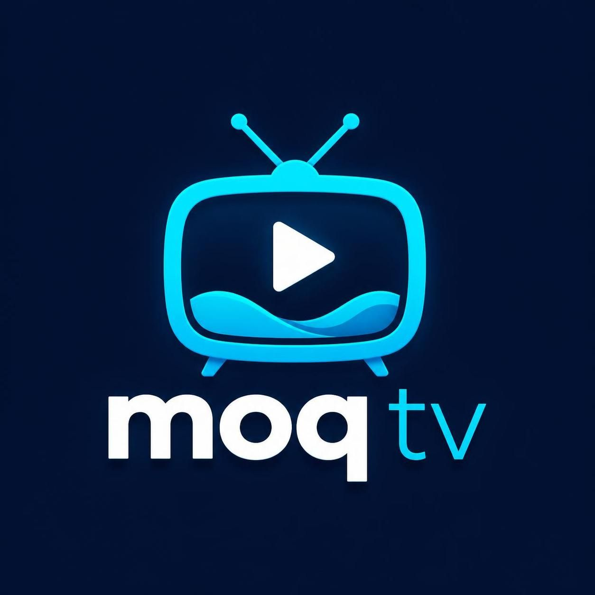

# moq-tv



**[moq-tv](https://github.com/cathode-ray-tube/moq-tv)** is a project to bring Media over QUIC (MoQ) to Smart TVs — focused on low-latency broadcasting and smooth viewer experience for live streams.

This project implements the **moq-lite** spec and builds on the amazing work of [moq](https://github.com/moq-dev/moq)

## Goals
- Provide a reference implementation for low-latency Media over QUIC (MoQ) on Smart TV platforms.
- Produce example apps for major Smart TV platforms that developers can run, study and modify.
- Demonstrate best practices for adaptive streaming, synchronization and resiliency using MoQ.

## Key Features
- Low-latency broadcasting with QUIC transport  
- Reference/example applications for main Smart TV platforms (initial targets below)  
- Modular design so developers can adapt or replace components  
- Simple APIs for ingesting, packaging, and playback

## Initial Platform Targets
- Web-based Smart TV apps (HTML5/JS) *coming soon*
- Samsung Tizen *coming soon*
- LG webOS *coming soon*
- Android TV / Google TV *coming soon*
- Roku (when feasible) *coming soon*

## Project Structure
- `/docs` — design notes and integration guides  
- `/server` — see Getting Started for instructions to use moq-relay  
- `/clients`  
  - `/web` — HTML5 reference player (should work on most web browsers, including Smart TV browsers)
  - `/tizen` — example Tizen app  
  - `/webos` — example webOS app  
  - `/androidtv` — example Android TV app  
  - `/roku` — example Roku app  
- `/assets` — logo and images (including `moq-tv-navy.jpeg`)  
- `/scripts` — helper scripts to run test streams, app packaging, etc

## Getting Started

1. Clone the repo:
   ```bash
   git clone https://github.com/cathode-ray-tube/moq-tv.git
   cd moq-tv
2. Run the moq-relay server from the moq project to provide QUIC-based relaying: [moq-relay](https://github.com/moq-dev/moq/tree/main/rs/moq-relay) (see that repository for setup and usage).
3. Serve the `/clients/web` example using a local dev server to test basic playback in a web browser.
4. Modify any example client to adapt to your platform or prototype new features.

## Contributing

All example apps are intentionally permissive for modification. Fork, adapt and open pull requests with improvements.

If you contribute code that changes licensing or IP expectations, please include a note in your PR.

## License

This project is dual-licensed: MIT OR Apache-2.0, choose either. See `LICENSE-MIT` and `LICENSE-APACHE-2.0` in the repository root.

## Roadmap

- Short-term: working demo for web and Android TV, basic QUIC ingest + playback.
- Mid-term: platform-specific optimizations (Tizen, webOS) and tooling for packaging.
- Long-term: reference broadcaster tools, SDKs, and a compliance test suite for Smart TV vendors.

## Contact
    
Questions/pull requests welcome, particularly for any currently-unsupported platform.
